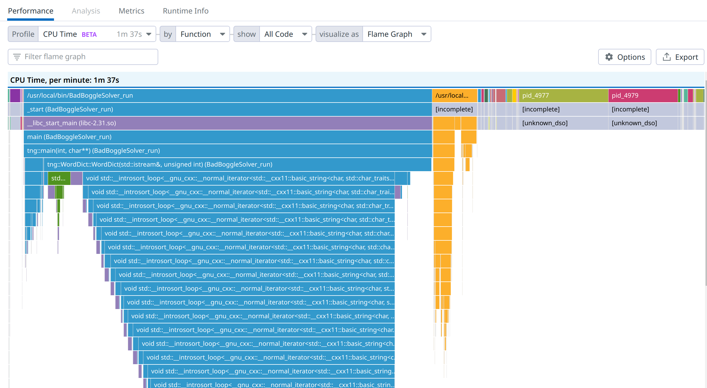

# Side Container

This is a demo to highlight side container profiling capabilities.
This is a work in progress please review the Datadog documentation on the recommended ways of running `ddprof`.

## Setup

The Datadog agent requires a docker.env file (within this directory) to work with your Datadog API key store within it. Example of content for the docker.env file.

```bash
DD_API_KEY=thisisnottheactualdatadogkeyhaha123
```

Running the container

```
docker-compose up
```

## Overview

### Profiler (ddprof-agent)

`ddprof` is the profiler. It runs with `CAP_PERFMON`. It access the unwinding and symbol information though `/proc/<PID>/root` folders.
 As it is not running as `SYS_ADMIN` it can not access all users running on the system.

### The app

This docker-compose launches a toy application : the `BadBoggleSolver`. We don't really care about what it does, it mostly burns CPU

## Expected output

### Un-priviledged

The profiler will not access all binaries (only the binaries that are run with the same user).



### Priviledged

With priviledged access, you will see all of the activity. On your laptop, this means seeing everything running, including the profiler.

### Allocation profiling

As we are not LD_PRELOADING, we can not intercept allocations.
